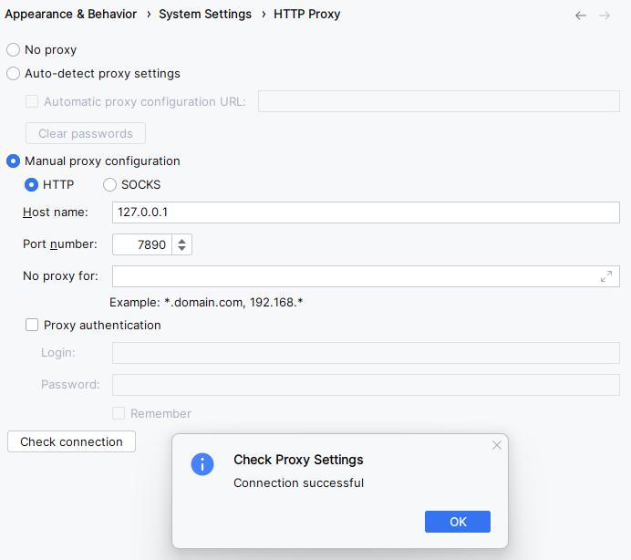

---
author:
- dedfaf
tags:
- android
date: 2024-03-1
lastmod: 2024-03-1
---

# 第1.1话 Android Studio安装及环境配置常见问题

此话用于收集安装Android Studio时遇到的各种奇葩问题及其解决思路，**持续更新，欢迎补充**

解决此类问题的核心思路：**看报错信息**。绝大部分遇到的错误都有前人总结的经验，此话无论如何不可能包含所有情况，提出的解决方法也不一定能完美解决你的问题。遇到问题可以自己搜索报错信息来找解决方法

## 常见问题

### 代理配置不正确

**绝大部分的问题都是网络问题**，遇到奇奇怪怪的问题解决不了，都可以怀疑文件下载过程出了问题。保证网路稳定之后，可以按照[卸载](./第1.0话%20Android%20Studio安装及配置.md#卸载)中的步骤，清理掉Android Studio的文件，参考下面的内容配置代理，重新安装一遍

配置问题，如果是手动设置代理设置，务必注意自己的配置类型是什么。

配置好后点左下角的`Check connection`连一下谷歌之类的网址检查自己的代理挂上了没有，如果你的代理有流量监控之类的功能也可以在下载时检查到底是怎么下载的

很多问题例如

- zip END header not found: gradle.zip下载时断断续续导致文件损坏，需要删掉gradle user home里面的东西重新下载

都大概率是由于代理其实没有挂上，下东西没成功导致的

### 虚拟机常见问题

在此罗列一些本人周边同学遇到问题

- 虚拟机无法启动：

    虚拟机无法启动的原因可太多了，如果遇到了此类问题请根据自己的报错或实际情况分析原因，下面是一些常见原因：
  - C盘空间不足
  - 没有关闭windows的虚拟机服务hyper-V
  - BIOS中没有打开CPU对虚拟机支持的选项
  - 内存太小

- 虚拟机下载完后不显示

    可能是代理不正确导致的

- 虚拟机开机，电脑直接重启

    目前还没找到这个玄学问题的原因，但是通过每次cold boot虚拟机可以避免

### Run app时虚拟机没反应

*检查虚拟机是否真的收到了app，目前一个比较玄学的原因是因为连接BIT-mobile无线网时就是传不过去*
