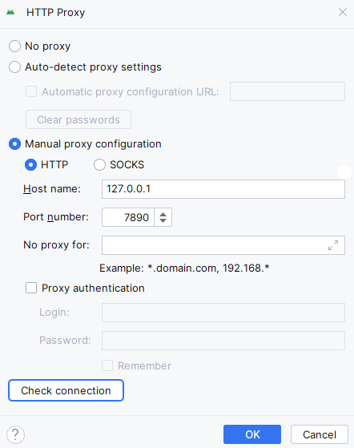

---
author:
- LTSlw
tags:
- android
date: 2024-02-21
lastmod: 2024-02-21
---

# 第1话 安装Android Studio

`Android Studio`是Android官方推出的IDE，用于Android开发，被广泛使用。绝大部分工作都可以在里面完成，比如编写代码、设计UI、构建应用、模拟不同的设备调试

## 配置要求

不同的平台的配置要求略有不同，总结一下

最低配置：

- 8GB RAM
- 8GB DISK
- 1280*800的屏幕
- 不太旧的cpu和操作系统

推荐配置：

- 16GB RAM
- 16GB SSD
- 1920*1080的屏幕

只看最低配置的话，其实要求不高，电脑配置虽然越高越好，但不必为此焦虑。详细的配置要求可以看[文档](https://developer.android.com/studio/install)

## 安装

官方的[文档](https://developer.android.com/studio/install)已经非常简单了，可以说是已经做到了无脑安装，推荐至少将文档看一遍

### Windows

Android Studio在Windows的下载安装非常简单(傻瓜操作)，只需要使用官方的安装程序就能一键下载本体+组件

#### 下载

直接到[官方首页](https://developer.android.com/studio?hl=zh-cn)下载安装包

#### 安装

运行android-studio-版本号-windows.exe

打开安装程序后等待一小会，如果联网失败会提示是否要配置代理。Android Studio组件的安装需要从`dl.google.com`下载，这时我们需要手动设置让Android Studio使用系统代理。下图是笔者的设置，供参考

在安装过程中设置过代理配置会自动保存，安装后就不用再设置一次



之后在安装程序中选择所有需要安装的组件（主要是Android SDK），注意安装Android SDK的路径不能带有空格，否则会影响NDK工具的使用

### Arch

下面介绍一个Arch Linux使用包管理器安装Android Studio的方法。Android Studio不是真正意义上的自由软件，因此不在官方源中，但可以在[AUR](https://aur.archlinux.org/packages/android-studio)中找到它

#### 启用multilib源

`Android SDK`依赖32位库，所以需要先启用`multilib`源，可以编辑`/etc/pacman.conf`

```
[multilib]
Include = /etc/pacman.d/mirrorlist
```

#### 安装本体和依赖

``` shell
yay -S android-studio android-sdk-cmdline-tools-latest-dummy android-sdk-build-tools-dummy android-sdk-platform-tools-dummy android-platform-dummy android-emulator-dummy
```

使用dummy包是允许`SDK Manager`管理SDK的同时安装好依赖，避免Pacman和SDK Manager同时插手SDK的管理，造成混乱

#### 设置网络

安装之后，即可启动Android Studio，此时会尝试联网，如果联网失败会有设置proxy的弹窗。填写完proxy之后建议测试连接，大量的组件要从`dl.google.com`下载，网络环境很重要

#### 安装组件

其实dummy包还帮我们做了添加`PATH`的工作，但它默认SDK存放在`/opt/android-sdk`，Android Studio默认将SDK存放在`~/Android/Sdk`，如果希望利用上自动配置的`PATH`，可以遵循以下步骤：

1. mkdir /opt/android-sdk
2. chmod 777 /opt/android-sdk
3. `Install Type`可以选择`Custom`，在下一页`SDK Components Setup`中把`Android SDK Location`改为`/opt/android-sdk`


#### 完成安装

接下来你需要同意许可协议并等待下载结束

[参考 Arch Wiki](https://wiki.archlinux.org/title/Android#Android_Studio)

## 配置

配置存放位置：

- ~/.android
- ~/.config/Google/AndroidStudio2023.1

打开Android Studio设置可以按快捷键`Ctrl+Alt+S`

### 更改主题

Appearance & Behavior -> Appearance -> Theme

### New UI

Appearance & Behavior -> New UI

新版UI还是含好看的，可以尝试一下，很多known issues我认为是可以接受的

### 背景图片

Appearance & Behavior -> Appearance -> Background Image...

### 网络设置

Appearance & Behavior -> System Settings -> HTTP Proxy

### 内存设置

Appearance & Behavior -> System Settings -> Memory Settings

这里应该按照电脑配置调整，大内存运行会更流畅，但受到电脑内存大小限制

### 快捷键设置

Keymap

### 管理插件

Plugins

### 配置低的电脑配置

- 减少分配内存，可以参考[内存设置](#内存设置)
- 开启`Power Save Mode`，File -> Power Save Mode，会关闭一部分功能
- 减少代码提示，Editor -> Inspections，去掉不需要的选项
- 使用一台安卓设备调试
- 关闭并行构建，Build, Execution, Deployment -> Gradle-Android Compiler -> Compile independent modules in parallel

[相关文档](https://developer.android.com/studio/intro/studio-config#low_memory)
