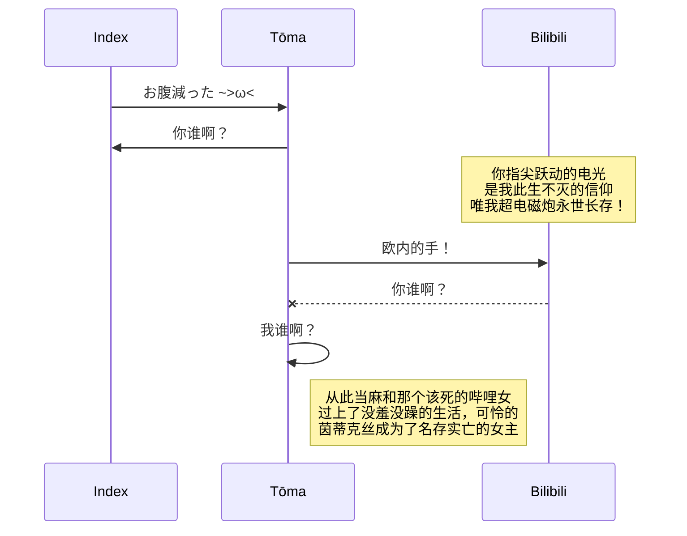
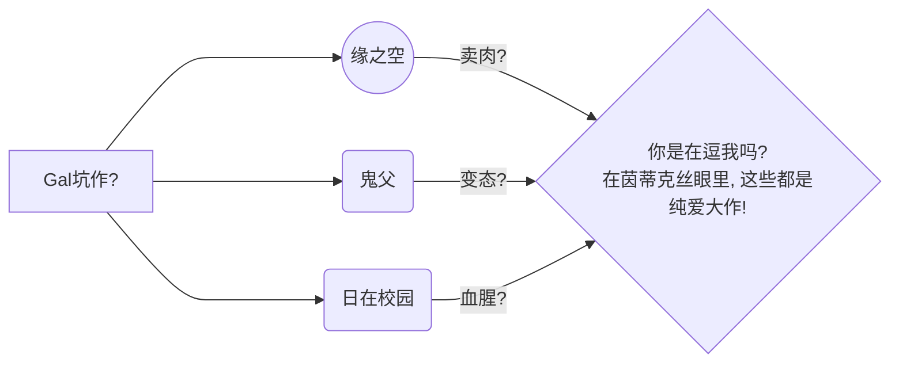

---
author:
- LTSlw
- dedfaf
tags:
- markdown
date: 2023-09-20
lastmod: 2023-09-22
---

# 计协 · 茵蒂克丝 基础篇 - 第0.1话 markdown进阶

相信在[markdown基础篇](第0.0话%20从markdown说开去.md)中你已经学会了最基础的markdown阅览，导出和编写。茵蒂克丝非常欣赏你进入本章，不止于markdown的皮毛！在之后的《计协 · 茵蒂克丝》以及以后的计算魔法学习中，自主了解和学习也是非常重要的！

本章的重点是展示一些编写markdown的技巧，以及一点点写出好markdown的经验。当然这些进阶技巧完全不需要你牢固掌握，你只需要留一个印象，当你需要用到这些内容的时候随时回来对照着写就可以了

*P.S. 茵蒂克丝希望你在将来~~使用计算魔法~~写代码的时候，尽可能对照着~~原版的计算魔法书~~官方文档去写，《计协 · 茵蒂克丝》终究只是茵蒂克丝比较片面的知识总结，肯定是不如官方文档来的全面和正确的。而且茵蒂克丝很忙你老来麻烦我我会很害羞...*

## markdown的进阶技巧

在这里茵蒂克丝会补充一些markdown格式的使用方式，以GFM为主，也会有一些超出GFM的好用功能，在看以下内容前，茵蒂克丝希望你可以再看一遍GFM的原文，以下的内容大部分是对GFM的补充，请务必掌握了markdown的基础语法后再看

[Github 官方文档 - Basic writing and formatting syntax](https://docs.github.com/en/get-started/writing-on-github/getting-started-with-writing-and-formatting-on-github/basic-writing-and-formatting-syntax)

[GitHub Flavored Markdown](https://github.github.com/gfm/)

#### 另一种标题格式

这种方式的效果和使用`#`相同，可以依据层级数量以及个人喜好使用

``` markdown
这是一级标题！喵~
===

这是二级标题！喵喵~
---
```

### html

除了GFM规定的格式以外，其他在html中的格式化代码也是可以在很多markdown编辑器中使用的

理论上来说，在markdown中嵌入html可以良好工作，但一般来说在写项目介绍或者写正常页面的时候不推荐写html。因为安全性的原因，各种编辑器对于html的支持参差不齐，需要注意编辑器对html的支持。而且大量使用html的话，就破坏了markdown的简洁，要尽可能少的使用，使用html也要注意html的标准和规范

一个简单的例子：

源码：

``` html
<span style="color: red">red words</span>
```

效果：

<span style="color: red">red words</span>

html相关的内容很多，茵蒂克丝建议你单独学习，也可以期待一下《计协 · 茵蒂克丝》的相关教程！

[GitHub Flavored Markdown - raw-html](https://github.github.com/gfm/#raw-html)

### 嵌套

markdown的各种语法一般都是可以嵌套的，产生冲突靠转义来解决

例如，让图片附带链接的方法

源码：

``` markdown
[](https://b23.tv/BV1GJ411x7h7)
```

效果：

[](https://b23.tv/BV1GJ411x7h7)

在这个例子中，外层：`[(内层)](https://b23.tv/BV1GJ411x7h7)`用于引入链接，内层（链接的说明）为``用于加入图片，因此图片成为了链接的说明

### 分割线

源码：

``` markdown
---
```

效果：

---

### LaTeX公式

markdown支持LaTeX公式，$ 表示行内公式 $$ 表示整行公式

~~*茵蒂克丝希望你们永远都用不上这个！*~~

源码：

``` markdown

$$ Dedicatus545\stackrel{H}{\longrightarrow}EroIndex! $$

```

效果：

$$ Dedicatus545\stackrel{H}{\longrightarrow}EroIndex! $$

关于LaTeX的编辑，此处不作详细说明，可以参考以下网站：

[LaTeX 官网](https://www.latex-project.org/)

[Markdown and LaTeX introduction](https://ashki23.github.io/markdown-latex.html#latex)

[MarkDown 中使用 LaTeX 数学式](https://www.cnblogs.com/nowgood/p/Latexstart.html)

需要注意在一些markdown编辑器里，行内公式是无法使用的，只能用整行公式（如joplin）

### Mermaid

[Mermaid 官网](http://mermaid.js.org/#/)

meimaid是一种能在markdown中使用的基于JavaScript的图表工具，可以用来快速生成逻辑图思维导图，Github在2022年添加了对markdown文件中JavaScript的图表工具的支持，因此mermaid图也可以在Github中使用了

在此给出几个简单的使用例，感兴趣的同学可以浏览[Mermaid Tutorials](http://mermaid.js.org/config/Tutorials.html)

源码：

```` markdown

````

效果：


源码：

```` markdown

````

效果：


