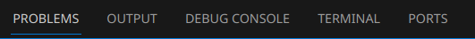
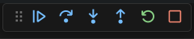

---
author:
- LTSlw
- dedfaf
tags:
- basic
- getting-start
- vscode
date: 2024-02-06
lastmod: 2024-02-29
---

# 编程环境与VSCode

每个开发者都要有一套趁手的工具。无论是编译、运行还是调试，各自都要依赖其他的软硬件，这些东西统称为环境。搭建环境是入门开发的必修课。本节除了介绍配置环境的一般方法，还会较为详细的介绍一个常用并且通吃的代码编辑器——VSCode

## 命令行简介

很长时间以来操作计算机没有图形界面，也就是说不存在鼠标这种东西，要靠键盘向名为`终端`（`Terminal`）的命令行中输入命令控制计算机。命令行占用资源小，易于开发，熟练使用命令行是一个合格开发者的必修课。由于前置知识不足，这部分内容仅限于打开终端运行各种命令，帮助你完成各种配置，详细的介绍会放到以后的章节

### 启动终端

#### Linux

使用Linux不可避免要用到终端，根据环境不同，打开你常用的终端即可，比如`Gnome Terminal`，`Konsole`，不多赘述

#### Windows

1. `Win+R`打开运行
2. 输入`cmd`回车

#### MacOS

运行`Terminal`

### 工作目录

启动终端之后你会看到一个光标，敲击键盘文字会出现在光标位置，光标左侧有一段路径（Linux和MacOS一般为`~`，Windows一般为`C:\Users\username`）路径是由路径分隔符（Linux和MacOS为`/`，Windows为`\`）连接的一系列文件（夹）名

这个路径就是当前的工作目录，每个文件（夹）在系统中都有唯一的路径，被称为绝对路径（例如Linux和MacOS中以`/`开头和Windows中以`C:\`开头的路径）。但是，绝对路径可能很长，写起来不方便，于是产生了相对路径

相对路径是相对于当前工作目录的路径，把绝对路径开头的工作目录的路径去掉就是某个文件夹的相对路径，例如一个文件位于`~/dir/file`，当前工作目录为`~/dir`，那么这个文件的相对路径就是`file`

切换相对路径可以使用命令`cd`，例如`cd ~/dir`，则会将工作目录却换到`~/dir`

路径还有一些特殊的表示：

- `.`：当前目录
- `..`：上级目录
- `~`：用户目录（cmd不可用）

其中`.`和`..`允许拼接，例如`../..`表示上级目录的上级目录

### 运行命令

一条命令由以下部分组成

```
command args
```

`command`表示调用的命令，有些命令是shell内建的，比如：`cd`。也有一些会调用外部程序，这些命令就需要你提前安装好才能使用

`args`表示参数，一条命令允许有多个参数，用空格分隔，这些参数会作为传入程序

命令输入结束后按`Enter`执行命令

## 配置环境的一般方法

**核心：看文档！！！**

大部分我们现在能接触到的软件都不是可以独立运行的，或多或少地依赖于其他组件，因此单纯复制粘贴二进制文件，不一定能运行起来，要把所有的依赖装好。那么如何知道应该安装哪些依赖呢？

答：看文档。只要软件基本可用，一般同时就会附有文档。大多数情况下，文档存放在软件官网、软件wiki、源码仓库的readme、仓库附带wiki这几个位置中的一个或几个。依赖可以算是文档必须记录的条目之一

你可能已经在使用一些包管理器了，比如`apt`、`pacman`，他们会自动帮忙管理依赖，如果恰巧里面没有包含你要使用的软件，那么这时候就需要自己手动安装依赖了，把文档中列出的所有依赖一一装好之后再安装你要使用的软件。*需要注意的是：有的依赖可能还有自己的依赖，也要一并装好才行*

> 茵蒂克丝：issue里提问文档明确写了的东西，说不定会挨骂哦

很多软件自身会提供二进制文件，这时候安装就比较方便，复制粘贴一般就能解决问题（不同操作系统略有差别，windows下可能是个安装包，linux下会有对应系统的软件包）

实际上，开发者没有提供二进制文件的义务，他们可能只留下了源代码，或者你为了安全要了解你使用的软件的所有代码，这时就必须手动编译，具体的编译方法也应该写在文档里，照着一步一步做就好了

### 开发的额外工作

上面的内容可能过于一般，运行任何程序都逃不过这些，开发有一套特有的工具，主要包括编辑器、编译器（或解释器）、调试器，项目管理软件

编译器和调试器很大程度由编程语言、系统等因素决定，暂且略过。项目管理软件有点宽泛，把版本控制、bug追踪等等软件全都算进来了，当你需要它的时候可以说已经不那么基础了，所以本节同样略过

#### 编辑器

只要写代码，必然会需要一个代码编辑器，也是最影响编程体验的部分，现代的编辑器普遍具有代码高亮、代码补全、安装扩展、调试等功能

常见的编辑器：

- [VSCode](https://code.visualstudio.com/)
- [Sublime](https://www.sublimetext.com/)
- [Vim](https://www.vim.org/)

> 茵蒂克丝：Dev-C++什么的还是算了吧

#### IDE

`IDE`(`Integrated development environment`，`集成开发环境`)，集成了某种开发需要的所有功能，大而全，配置简单，与外部环境相对独立，便于管理。典型的例子是Visual Studio，乍一看和VSCode很像，但如果实际安装一下你一定可以发现它们的不同，VS允许你选择安装很多工作负载

IDE虽然方便，但也容易装上很多不需要的东西，当需要使用IDE里没有的东西时优势也不明显，大部分IDE不开源且价格不菲

#### 整合包

整合包和IDE比较像，但不是由大公司专门开发，而是民间为了特定的功能自行打包，算是介于自行配置和IDE之间。使用起来比自行配置简便但也比IDE复杂。控制整合包版本也可以做到软件行为基本一致，可以自己控制包的细节，但不如大公司开发的IDE稳定，不了解整合包的细节在出问题时难以排查

> 茵蒂克丝：推荐只要对简便没有特别的追求，还是试一下自行配置

## VSCode

[`VSCode`](https://code.visualstudio.com/)（`Visual Studio Code`），是一个跨平台代码编辑器，由Microsoft主导开发，支持多种语言和丰富的扩展，是最流行的代码编辑器之一

### VSCode是不是开源软件

是也不是。VSCode有诸多版本：

- `Code - OSS`：开源的部分，MIT协议，[git仓库](https://github.com/microsoft/vscode)
- `VSCode`：微软的定制版本，非自由，官网上可以直接下载到，使用了闭源的api和扩展市场
- `VSCodium`：社区定制版，MIT协议，[官网](https://vscodium.com/)，默认禁用遥测，github认证使用个人token，并使用[`Open VSX`](https://open-vsx.org/)作为默认扩展市场，虽然不如微软市场丰富，但开源

本篇对以上3个版本通用

### 安装VSCode

进入官网[下载界面](https://code.visualstudio.com/#alt-downloads)，下载你使用平台对应的版本

#### Windows

运行安装包，按照提示一步一步安装就好了

#### Linux

如果发行版的软件仓库里有VSCode，那么建议直接使用仓库里的。遗憾的是，因为是非开源自由软件，很多发行版不会收录VSCode，但是安装依然很方便

##### Debian

首先从官网下载`code_xxxx_xxxx.deb`，之后运行`apt install code_xxxx_xxxx.deb`（也可以用dpkg）

##### Arch

AUR已经有人打包好了，[visual-studio-code-bin](https://aur.archlinux.org/packages/visual-studio-code-bin)，除了使用`yay`自动化安装，也可以手动安装

``` shell
git clone https://aur.archlinux.org/visual-studio-code-bin.git
cd visual-studio-code-bin
makepkg -s
pacman -U visual-studio-code-bin-xxxx-xxxx.pkg.tar.zst
```

##### 手动安装

下载`code_xxxx.tar.gz`，解压到`/opt`，在`/usr/local/bin`下创建`code`的软链接

#### MacOS

把`Visual Studio Code.app`拖进`Applications`即可

#### PWA（扩展功能不完整）

VSCode支持PWA，有浏览器就可以做到类似原生应用的效果，节约空间，只需进入[vscode.dev](https://vscode.dev/)，之后浏览器会弹出`Install`按钮，点击即可

### 初次运行VSCode

初次运行VSCode会有一个向导，引导你修改主题，安装扩展，设置VSCode，可以跟着走一遍


#### 设置主题

快捷键：`Ctrl+K Ctrl+T`

#### 按键映射

如果已经习惯了其他编辑器，在扩展里搜索`@category:"Keymaps"`，选择按键映射安装即可

#### 安装简体中文语言包

如果你不适应英文，VSCode官方提供了很多的语言包（language pack），可以作为扩展安装，在扩展选项卡里搜索`@category:"Language Packs"`，查看所有语言包

简体中文语言包：[Chinese (Simplified) (简体中文) Language Pack for Visual Studio Code](https://marketplace.visualstudio.com/items?itemName=MS-CEINTL.vscode-language-pack-zh-hans)

> 茵蒂克丝：能把文件名一并翻译，不愧是微软式中文，直接用英文也挺好的

切换语言包：`Ctrl+Shift+P`进入Command Palette，输入`Configure Display Language`，选择语言

### 常用的功能

#### 菜单栏

最上面是菜单栏，里面包含里所有的功能，虽然复杂，但忘了快捷键就去里面找吧

#### 左侧的选项卡

快捷键：`Ctrl+B`展开/收起侧边栏

从上到下依次是：

- `资源管理器`（Explorer）：包含了当前的工作区，大纲（outline），时间线（timeline，记录文件修改），如果有需要还可以从其他选项卡拖动更多内容进来，是最常用的界面
- `搜索`（Search）：可以进行查找和替换，范围是整个工作区里的文件
- `源代码管理`（Source Control）：实际就是接入git，VSCode是原生支持git的
- `运行和调试`（Run and Debug）：根据`launch.json`，调试运行
- `扩展`（Extensions）：安装和管理扩展，可以连接扩展市场下载插件

#### 下侧栏



快捷键：`Ctrl+J`显示/隐藏下侧栏

写代码时一般切换到`PROBLEMS`，IntelliSence分析你代码，给出警告和错误。调试时一般切换到`DEBUG CONSOLE`或`TERMINAL`。`OUTPUT`是来自VSCode的输出，当插件行为不合预期或者出现bug，可以在里面找到一些提示

#### 设置

快捷键：`Ctrl+,`

`settings.json`的图形配置，不只有VSCode自身的设置，扩展的设置也在里面，也可以手动编辑`settings.json`达到同样效果

配置文件位置：

- 用户：`~/.config/Code/User/settings.json`（`$XDG_CONFIG_HOME/Code/User/settings.json`）
- 工作区：`.vscode/settings.json`

工作区配置文件的优先级高于用户配置文件

#### 打开文件和文件夹

打开文件快捷键：`Ctrl+O`  
打开文件夹快捷键：`Ctrl+K Ctrl+O`（先按Ctrl+K，再按Ctrl+O）

#### 打开终端

快捷键：`` Ctrl+` ``


除了出现常规的终端，可以见到右上角还有这样的几个按钮，点击`+`右侧的下箭头，除了可以拆分终端，还允许在指定终端里运行task。如果你的系统中有多种`shell`，你可以点击`Select Default Profile`选择一个最常用的

点击右面`...`，可以执行当前文档或者把选中的文字作为命令在终端执行，在阅读本教程时可以使用此功能简化操作

#### CLI命令

``` shell
code -h                                 # -h表示--help，显示帮助
code .                                  # 打开当前文件夹
code -d <file1> <file2>                 # -d表示--diff，对比<file1>和<file2>
code -m <path1> <path2> <base> <result> # -m表示--merge，git mergetool会用到，后续章节会细说
code --install-extension                # 命令行安装插件，既可以指定扩展id，也可以使用vsix
code serve-web                          #
```

#### 配置文件

如果你需要不同的工作环境，一种简单的方式就是创建多个配置文件，点击左下角齿轮 -> `Profiles`，管理配置文件。VSCode内置了一些配置文件模板，同时配置文件支持导入和导出，可以方便的配置你的工作环境

配置文件之间可以完全独立，每个配置文件各自拥有不同的设置、快捷键、扩展、tasks、UI、按键设置、代码片段

也可以部分配置，一部分配置独立，另一部分使用默认配置

配置文件存储位置：- 用户：`~/.config/Code/User/profiles`

#### 其他常用功能和快捷键

- `Ctrl+O`：打开文件
- `Ctrl+K Ctrl+O`：打开文件夹（先按Ctrl+K，再按Ctrl+O）
- `Ctrl+Shift+P`：打开命令面板（Command Palette），包含VSCode和扩展的功能入口
- `Ctrl+PGUP`和`Ctrl+PGDN`：向前和向后切换标签
- `Ctrl+1`、`Ctrl+2`、`Ctrl+3`...：切换编辑器，如果你对编辑器做了拆分，可以用这些快捷键切换
- `Ctrl+K M`：设置当前文件语言
- `F11`：全屏
- `Ctrl+K Z`：禅模式
- `Ctrl++`：放大
- `Ctrl+-`：缩小
- `Ctrl+0`：重置缩放
- `Ctrl+Shift+B`：运行默认build task

### 编辑器

#### Snippets

`Snippets`是一些模板代码片段，可以将常用的语句制成snippet，利用代码补全功能快速编写代码，如果明确要使用snippets，也可以在命令面板里调用`Snippets: Insert Snippet`

VSCode内置了一些snippets，有些扩展扩展也包含一部分snippets（可以在扩展市场里搜索`@category:"snippets"`）

VSCode也允许创建你自己的snippets， 点击`左下角齿轮` -> `User Snippets` -> 选择要编辑的snippets

snippets存放于以下位置：

- 用户：`~/.config/Code/User/snippets/*.code-snippets`或`~/.config/Code/User/snippets/${language}.json`
- 工作区：`.vscode/*.code-snippets`

格式如下

``` json
{
    "name": {              // name可以自定义，snippet的唯一标识，显示在ui中
        "description": "", // 说明，比name更加详细
        "prefix": [        // 前缀，在编辑器中输入前缀会，补全中会显示snippet，允许一系列字符串构成数组
            "log"
        ],
        "body": [],        // snippet的内容，允许一系列字符串构成数组，元素之间会自动插入换行，具体语法见下文
        "scope": ""        // snippet的作用域，用','分隔的一些列语言标识
    }
}
```

body的语法是[TextMate Snippets](https://macromates.com/manual/en/snippets)的变种，[VSCode Snippets](https://code.visualstudio.com/docs/editor/userdefinedsnippets#_snippet-syntax)语法略有不同。简单来说

- `$数字`用于保留输入位置，插入snippet之后指针会跳转到输入位置，可以按`Tab`切换输入位置，多个位置值相同可以重复相同数字
- `$变量名`可以将变量插入
- `${变量:默认值}`指定默认值
- ``` `` ```包裹的内容会作为shell命令执行并插入结果

更多的高级语法，例如：允许插入的变量、处理捕获的字符串，建议查看文档

> 茵蒂克丝 tips：VSCode没有原生提供snippets自动补全，但可以添加[非官方schema](https://raw.githubusercontent.com/Yash-Singh1/vscode-snippets-json-schema/main/schema.json)

#### 编辑器快捷键

- `Ctrl+A`、`Ctrl+C`、`Ctrl+V`：全选、复制、粘贴
- `Ctrl+Z`和`Ctrl+Shift+Z`：撤销和重做
- `Ctrl+L`：选中一行
- `Ctrl+/`：注释一行
- `Ctrl+F`：查找
- `Ctrl+H`：替换
- `F2`：重命名标识
- `F9`：添加/删除断点
- `Shift+F9`：添加/删除行内断点
- `Alt+Click`：在点击位置增加一个光标
- `Shift+Alt+Drag`：矩形选择
- `Ctrl+K Ctrl+X`：去除选中文本行末空格
- `Ctrl+Shift+I`：格式化文档
- `Ctrl+K Ctrl+F`：格式化选中文本
- `Ctrl+Shift+[`和`Ctrl+Shift+]`：折叠和展开代码块
- `Ctrl+K Ctrl+0`和`Ctrl+K Ctrl+J`：折叠和展开文档
- `Ctrl+Space`：显示IntelliSense建议
- `Tab`：自动补全代码
- `Ctrl+Click`：跳转到定义
- `Alt+Scroll`：快速滚动

[更多快捷键](https://code.visualstudio.com/docs/getstarted/keybindings#_default-keyboard-shortcuts)

### Tasks

`Tasks`允许你定义自己的任务，调用外部程序，在需要的时候自动执行一系列的命令，例如生成、测试，有些插件也会提供一些task模板，简化配置，使用tasks可以打开命令面板(`Ctrl+Shift+P`)输入`Tasks:`，就可以看到一系列有关的命令，`Ctrl+Shift+B`可以运行默认的build task。Tasks由`tasks.json`管理

`tasks.json`位置：

- 用户：`~/.config/Code/User/tasks.json`（`$XDG_CONFIG_HOME/Code/User/tasks.json`）
- 工作区：`.vscode/tasks.json`

`tasks.json`应遵循以下格式：

``` json
{
    "version": "2.0.0", // 固定为2.0.0
    "tasks": [ // 下面每个{}都是一个task，允许多个task存在
        {
            // task 1
            "label": "echo",
            "type": "shell",
            "command": "echo hello"
        },
        {
            // task 2
        }
    ],
    "inputs": [                     // 接收用户输入
        {
            "id": "my-var",         // 变量的唯一标识
            "type": "promptString", // 类型，可能的值为"promptString"、"pickString"和"command"，"promptString"会显示一个输入框，用户手动输入，"pickString"会显示一系列字符串，允许用户从中选择，"command"表示在命令面板中运行命令
            "description": "uasge", // "promptString"和"pickString"可用，输入框的提示
            "default": "sample",    // "promptString"和"pickString"可用，输入的默认值
            "password": false,      // "promptString"可用，输入内容是密码，不在屏幕显示
            "options": [],          // "pickString"可用，一系列可用字符串构成的数组
            "command": "",          // "command"可用，运行的命令
            "args": {}              // "command"可用，传入的参数
        }
    ]
}
```

每个task可以包含以下内容：

``` json
{
    "label": "test",         // 必须，task的唯一标识
    "detail": "a test task", // 对task的描述，会显示在Tasks: Run Task界面
    "type": "shell",         // 可能的值为"process"和"shell"，不设置默认为"process"，"shell"会启动默认的终端并把"command"作为命令运行，“process"会把"command"作为一个可执行文件的路径运行（遇事不决用shell）
    "key": "ctrl+h",         // 绑定快捷键
    "command": "./test.sh",  // 必须，运行的命令
    "args": [""],            // 传递的参数
    "group": {               // 不设置默认为"none"，也可以简写为"kind"对应的值，"isDefault"默认为false
        "kind": "test",      // 可能的值为"none"，"build"和"test"
        "isDefault": true    // 设置为默认build（test） task，命令面板中运行Tasks: Run Build（Test） tasks，会调用默认的task
    },
    "dependsOn": [""],          // 依赖的tasks
    "dependsOrder": "parallel", // 依赖执行顺序，可能的值为"parallel"和“sequence”，默认为"parallel"，"parallel"表示并行，“sequence”表示顺序
    "hide": true,               // 将task在Run Task界面隐藏，默认false，如果这个task只是其他tasks的依赖，不妨隐藏
    "isBackground": true,       // 执行的任务是否保持活动状态并在后台运行
    "promptOnClose": false,     // 在关闭VSCode时如果task还在运行是否提示
    "options": {
        "cwd": "",                // 当前工作目录
        "env": {},                // 环境变量
        "shell": {
            "executable": "bash", // 使用的shell
            "args": [""]          // shell的参数
        }
    },
    "problemMatcher": [                // 如果只有一个problem matcher，可以不写[]
        "$go",                         // 一些预定义的problem matcher可以直接使用"$"开头的字符串调用，安装扩展可能会添加预定义的problem matcher
        {
            "base": "$go",             // 基础problem matcher，后续的设置在此基础上修改
            "owner": "go",             // 问题所有者，允许的值是language service的唯一标识，默认值为"external"
            "source": "golang",        // 描述问题来源，人类可读
            "severity": "error",       // 描述问题的严重性，可能的值为"error"、"warning"和"info"，默认值为"error"，在"pattern"未指定的情况下使用本设置
            "applyTo": "allDocuments", // 控制显示在问题面板中的文件，可能的值为"allDocuments"、"closedDocuments"和"openDocuments"，分别表示显示全部文件，关闭的文件和打开的文件
            "pattern": [{              // 数组中每个{}是一个pattern
                "regexp": "",          // 匹配问题的正则表达式
                "kind": "location",    // 问题类型，可能的值为"location"和"file"，默认值为"location"，"location"表示问题出现在某个文件的某个位置，"file"表示问题出现在某整个文件
                "location": 2,         // 问题位置匹配模式，要求"kind"设置为"location"，序号依次对应3种不同模式：(line), (line,column) and (startLine,startColumn,endLine,endColumn)
                // 问题相关条目对应的捕获序号，有效性受"location"影响，"message"默认为0
                "file": 1, "line": 2, "column": 3, "endLine": 4, "endColumn": 5, "severity": 6, "code": 7, "message": 8,
                "loop": true           // 是否循环匹配
            }],
            "background": {            // 用于跟踪在后台任务的开始和结束
                "activeOnStart": true, // 在任务开始时是否开始匹配
                "beginsPattern": {     // 开始匹配的标志
                    "regexp": "",      // 正则表达式
                    "file": 0          // 文件对应的捕获
                },
                "endsPattern": {       // 结束匹配的标志
                    "regexp": "",      // 正则表达式
                    "file": 0          // 文件对应的捕获
                }
            },
            "fileLocation": [          // 指示VSCode解析问题信息中的路径，如果只需要第0个参数可以不使用数组，直接使用字符串
                "autoDetect",          // 数组第0个参数表示规则，可能的值为"absolute"、"relative"、"autodetect"和"search"，"absolute"表示路径被视为绝对路径，此时无需后续参数，"relative"表示路径被视为相对路径，"autodetect"会首先尝试把路径作为相对路径看待，如果找不到文件则把路径作为绝对路径，"search"会在后面目录中搜索（它的下一参数也比较特殊）
                "${workspaceFolder}"   // 第0个参数为"absolute"时，无需本参数，设置为"relative"和"autodetect"时此参数意义相同，是一个表示路径的字符串，指定相对路径的根目录，如果不指定则认为根目录为当前工作目录，上一参数为"search"时，本参数为一个object，基本格式为{"include": [], "exclude": []}，"include"和"exclude"都是一些列路径组成的数组，表示要进行和不要进行搜索的路径
            ], 
        }
    ],
    "presentation": {             // 任务输入输出相关设置，不设置会在运行任务时询问
        "echo": true,             // 显示运行的命令，默认true
        "reveal": "always",       // task面板是否弹出，可能的取值为"always"、"never"和"silent"，默认"always"，"silent"表示在任务出错时弹出
        "focus": false,           // 任务获得焦点，默认为false，如果为true，"reveal"将失效 
        "panel": "shared",        // 共享面板，可能的值为"shared"、"new"和"dedicated"
        "showReuseMessage": true, // 面板重用是否输出提示，默认true
        "clear": false,           //  执行task前是否清空面板，默认false
        "close": false,           // 任务结束关闭面板，默认false
        "revealProblems": "never" // 运行任务显示问题面板，可能的取值为"always"、"never"和"onProblem"，默认值"never"，类似于"reveal"，但优先级高于"reveal"
    },
    "linux": {}, "windows": {}, "osx": {}, // 对指定系统应用特殊设置
    "icon": {
        "id": "bug",                   // 图标id
        "color": "terminal.ansiWhite", // 图标颜色
    },
    "runOptions": {
        "instanceLimit": 1,        // 允许同时允许的task数量
        "reevaluateOnRerun": true, // 重新运行task是否重新解析变量，默认true
        "runOn": "default"         // 何时运行task，可能的值为"default"和"folderOpen"，"folderOpen"表示在打开文件夹时运行task
    }
}
```

> 茵蒂克丝 tips：VSCode给`tasks.json`内置了提示，也可以查看文档中的[`schema`](https://code.visualstudio.com/docs/editor/tasks-appendix)

### 运行和调试

VSCode可以连接到很多外部的调试器，并且内置了一些语言的调试器，也可以通过安装插件来支持更多语言（可以搜索`@category:debuggers`）。VSCode可以自动检测需要的调试器，无需配置，如果没有检测到，就需要手动配置，调试通过`launch.json`管理。简单的项目可能不需要手动配置，但如果比较复杂，那么配置`launch.json`是更好的选择

`launch.json`存放在`.vscode`目录下，如果需要全局配置，可以把配置放在`settings.json`的`launch`属性中

调试过程中会显示调试工具栏



从左到右功能依次是：

- 继续/暂停：暂停/继续程序执行
- 逐句调试：运行到下一行代码
- 单步调试：运行到下一步，会跟踪代码内部的执行过程
- 单步跳出：执行完后续过程跳出单步调试
- 重启：重新开始调试或运行
- 停止：停止调试或运行

#### 断点

调试时可以给代码标上断点，调试过程中，程序运行到断点位置会暂停，允许你观察程序的运行状态。断点可以在代码编辑器中点击行号左边的空白或者按`F9`，添加/删除断点，在Run and Debug中也可以集中管理断点，不止添加/删除，还可以暂时启用和停用断点。VSCode用圆形代表断点

条件断点是一种特殊的断点，触发断点需要一定条件，条件可以是表达式、命中次数或某个其他断点被命中，触发断点的图标是圆形加双横线

当断点触发，程序暂停时，在Run and Debug的`VARIABLES`中，可以观察程序运行的变量的值，`WATCH`可以跟踪特定表达式，`CALL STACK`可以查看程序调用栈，在DEBUG CONSOLE中可以计算表达式

断点还有一个变种——日志点（`logpoint`），程序运行到这里不会暂停，但可以按照你的要求记录下一条日志并打印在`DEBUG CONSOLE`，要添加日志点，可以在行号左侧右键 -> 点击`Add Logpoint`，之后会弹出一个输入框，里面可以编辑日志输出的格式，并用`{}`括起变量，例如`value of n is {n}`，logpoint用菱形表示

#### launch.json

`launch.json`的格式：

``` json
{
    "version": "0.2.0",
    "configurations": [
        {
            // configuration 1
        },
        {
            // configuration 2
        }
    ],
    "compounds": [
        {}
    ],
    "inputs": [] // 接收用户输入，和tasks.json语义相同
}
```

不同的调试器接受的configuration不同，每个configuration可以共同包含以下内容：

``` json
{
    "name": "debug-app", // 必须，configuration的唯一标识
    "type": "cppdbg",    // 必须，调试器类型
    "request": "launch", // 必须，请求类型，可能的值为"launch"和"attach"，"launch"表示启动程序并把调试器附加到程序上，"attach"表示直接把调试器附加到某个已经在运行的程序上
    "preLaunchTask": "build-task", // 调试前调用的task，值为task的唯一标识
    "postDebugTask": "clean-task", // 调试结束调用的task
    "serverReadyAction": {                       // 自动打开网址
        "action": "openExternally",              // 行为，可能的值为"openExternally"、"debugWithEdge"和"debugWithChrome"，默认值为"openExternally"
        "pattern": "listening on port ([0-9]+)", // 捕获url有关参数的正则表达式
        "uriFormat": "http://localhost:%s",      // url字符串，%s匹配"pattern"第一个捕获
        "webRoot": "",                           // "action"为"debugWithEdge"和"debugWithChrome"时有效
        "killOnServerStop": false                // 服务器停止时结束进程
    },
    "linux": {}, "windows": {}, "osx": {},       // 对指定系统应用特殊设置
    "internalConsoleOptions": "openOnFirstSessionStart", // 打开DEBUG CONSOLE的时间，可能的值为"openOnFirstSessionStart"、"openOnSessionStart"和"neverOpen"，默认"openOnFirstSessionStart"
    "presentation": {
        "hidden": false, // 是否在命令面板中隐藏，默认false
        "group": "",     // 把configuration归类到组，默认""
        "order": 1       // configuration在group的次序
    },
    "debugServer": 4711, // debugger扩展开发使用，指定调试器端口，默认4711

    // 以下属性不通用，由debugger扩展定义，具体语义应查看扩展文档
    "program": "", // 被调试的程序
    "args": "",    // 传入程序的参数
    "env": "",     // 环境变量
    "envFile": "", // 环境变量文件
    "cwd": "",     // 工作目录
    "console": ""  // 终端
}
```

有时可能需要同时运行多个调试，比如前端和后端，除了分别运行两个调试，也可以配置`compounds`，每个compound可以包含以下内容：

``` json
{
    "name": "debug-apps",          // compound唯一标识
    "configurations": [            // 运行的调试，由configuration的唯一标识构成数组
        "debug-app"
    ],
    "preLaunchTask": "build-task", // 调试前调用的task，值为task的唯一标识
    "stopAll": false,              // 一个调试结束是否停止所有调试
    "presentation": {}             // 和configurations中的presentation语义相同
}
```

> 茵蒂克丝 tips：VSCode对`launch.json`也内置了提示，但文档中没有提供schema

#### 调试快捷键

- `F5`：开始调试/继续/暂停
- `Ctrl+F5`：开始运行
- `Shift+F5`：停止
- `Ctrl+Shift+F5`：重启
- `F10`：逐句调试
- `F11`：单步调试
- `Shift+F11`：单步跳出
- `Shift+Enter`：在DEBUG CONSOLE中输入换行

### 变量

在配置`tasks.json`和`launch.json`时，可以引用一些变量，让配置更通用，简化配置，插入变量的格式是`${variable}`，所有的变量可以参考[文档](https://code.visualstudio.com/docs/editor/variables-reference)

- userHome：用户目录绝对路径
- workspaceFolder：工作空间目录绝对路径
- workspaceFolderBasename：工作空间文件夹名
- file：当前打开文件的绝对路径
- fileWorkspaceFolder：当前打开文件的工作空间目录绝对路径
- relativeFile：当前打开文件相对工作空间的相对路径
- relativeFileDirname：当前打开文件所在文件夹相对工作空间的相对路径
- fileBasename：当前打开文件的文件名
- fileBasenameNoExtension：当前打开文件去掉扩展名的文件名
- fileExtname：当前打开文件的扩展名
- fileDirname：当前打开文件所在文件夹的绝对路径
- fileDirnameBasename：当前打开文件所在文件夹的名称
- cwd：task运行的当前工作目录
- lineNumber：当前打开文件的行号
- selectedText：当前选中的文本
- execPath：VSCode的绝对路径
- defaultBuildTask：默认build task的唯一标识
- pathSeparator或/：当前系统的路径分隔符
- env:ENV_VAR：环境变量ENV_VAR的值
- config:CONF_VAR：设置中CONF_VAR的值
- command:CMD：命令面板中运行CMD的结果
- input:INPUT_VAR：用户输入INPUT_VAR的值
- workspaceFolder:rootFolder：多根目录时rootFolder的绝对路径

### 多根目录的工作空间

菜单栏`File` -> `Add Folder to Workspace`，可以添加文件夹到工作空间，此时工作空间的配置便需要保存到一个单独的文件中。菜单栏`File` -> `Save Workspae As...`，保存后会得到一个`.code-workspace`文件。

`.code-workspace`文件实际上就是一个json

``` json
{
	"folders": [      // 包含的根目录
		{
			"name": "",
			"path": ""
		}
	],
	"settings": {},   // 工作空间设置
	"extensions": {}, // 工作空间的扩展
	"launch": {},     // 调试，与launch.json语法相同
	"tasks": {}       // tasks，与tasks.json语法相同
}
```

每个根目录各自的`settings.json`、`tasks.json`和`launch.json`依然生效，但影响整个编辑器的设置将被忽略

### 整合包

我们给Windows制作了整合包，集成了`C/C++`的编译和调试，不依赖外部环境，可以在Release中下载

Linux...

都用Linux了要什么整合包

> 茵蒂克丝：况且Linux配置C/C++环境真比Windows简单吧

[^1]:本章内容参考了[「实用技能拾遗」系列辅学课程网站](https://slides.tonycrane.cc/PracticalSkillsTutorial/)
